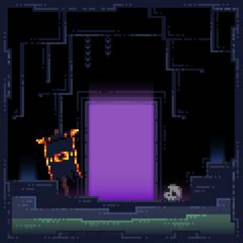

# 劫后余生 · Surviving the Aftermath



作者：**sxuuz** · GitHub：[@uuzsx](https://github.com/uuzsx)

This Mod supplements the vanilla raid content and adds related API to expand more adventure content.
Explore ruined structures and cities, face the Nether Raid, and discover powerful enchantments.

劫后余生：扩展原版突袭玩法，加入下界副本、遗迹、城市与附魔。
使用黄金、钻石、下界合金打火石分别开启简单 5 波、普通 9 波、困难 13 波挑战；每波开始时建筑逐渐下界化，胜利后获得奖励并播放音乐。

当前分支 **`1.21.2`** 对应 **Minecraft 1.21.2 / NeoForge 21.2.1-beta / Java 21**，模组版本为 **0.0.4-rc.26**。
每个版本都在自己的分支根目录独立构建；默认分支 `main` 为 1.20.1。

## 版本与分支

| Minecraft | 加载器 / 验证版本 | Java | 分支 |
| --- | --- | --- | --- |
| 1.20.1 | Forge 47.2.1 | 17 | [main](https://github.com/uuzsx/SurvivingTheAftermath/tree/main) |
| 1.21.1 | NeoForge 21.1.251 | 21 | [1.21.1](https://github.com/uuzsx/SurvivingTheAftermath/tree/1.21.1) |
| 1.21.2 | NeoForge 21.2.1-beta | 21 | [1.21.2](https://github.com/uuzsx/SurvivingTheAftermath/tree/1.21.2) |
| 26.1.1 | NeoForge 26.1.1.15-beta | 25 | [26.1.1](https://github.com/uuzsx/SurvivingTheAftermath/tree/26.1.1) |
| 26.1.2 | NeoForge 26.1.2.109 | 25 | [26.1.2](https://github.com/uuzsx/SurvivingTheAftermath/tree/26.1.2) |
| 26.2 | NeoForge 26.2.0.88 | 25 | [26.2](https://github.com/uuzsx/SurvivingTheAftermath/tree/26.2) |
| 26.3 | NeoForge 26.3.0.16-beta | 25 | [26.3](https://github.com/uuzsx/SurvivingTheAftermath/tree/26.3) |

## 游玩

- 使用 **1 个燧石 + 1 个金锭 / 钻石 / 下界合金锭**无序合成对应打火石，右击门框内侧选择简单 / 普通 / 困难挑战。每次激活消耗 1 点耐久，共 64 次。
- 每波开始时，建筑部分方块变为下界材质，楼梯保留朝向、上下半部、拐角和含水状态。
- 副本怪物不掉落物品和经验；胜利时播放音乐并开始发奖，发奖结束后可再次激活。
- 胜利音乐以建筑中心为声源，在 48 格内随距离衰减。成功重新激活，或最后一名玩家离开范围时停止；回来不会续播。

## 更新记录

rc.26 为新生成结构加入专用战利品表，城市稳定选择 21/209 个木桶有补给，其余结构箱桶全部有补给。详情见 [结构战利品](docs/STRUCTURE_LOOT-rc.26.md)。

rc.25 将进度条上方标题改为「下界入侵 · 简单／普通／困难」，保留整行渐变和下方波次。此次仅修改显示文字并重新构建 JAR，未重跑整套测试。

rc.24 将难度名称居中显示在进度条上方，以红、橙、金色平滑渐变；波次单独显示在下方，同时调整多个进度条的间距。见 [HUD 排版与验证](docs/HUD-rc.24.md)。

rc.23 将默认副本怪物改为从传送门底部依次步行入场，避免高处抛射与摔伤；支持门口台阶、排队存档恢复和出口堵塞处理。各波数量、装备与 rc.22 奖励价格保留。见 [传送门登场与验证](docs/ENTRANCE-rc.23.md)。

rc.22 增加简单／普通／困难通关保底核心 4／10／20 个，并降低附魔书和食物价格；普通通关保底即可兑换大师商人的任意一本书。旧商人自动降价并保留商品与库存。见 [奖励与商人价格](docs/ECONOMY-rc.22.md)。

rc.21 使用统一的 13 波近战／弩猪灵／成年疣猪兽／蛮兵配置，简单打前 5 波、普通前 9 波、困难全部 13 波；盔甲按固定配额随机分给怪物，前期无甲或散件。见 [波次配置与验证](docs/ROSTER-rc.21.md)。

rc.20 猪灵和蛮兵逐只按波次权重抽取装备；普通第 8 波、困难第 9 波开始出现钻石甲，困难第 12 波开始出现下界合金甲。见 [装备权重与验证](docs/EQUIPMENT-rc.20.md)。

rc.19 新增黄金和下界合金打火石，支持简单 5 波、普通 9 波、困难 13 波；困难后期包含战斗附魔和战斗增益，通关奖励分档。见 [三档挑战与验证](docs/DIFFICULTY-rc.19.md)。

rc.18 遗物商人每级解锁三项交易（3/6/9/12/15），增加附魔书与食物、升级优惠及旧存档兼容；附魔书移入本模组创造栏，删除核心与钻石打火石的悬浮说明。见 [商人交易与验证](docs/RELIC-TRADES-rc.18.md)。

rc.17 修复城市生成后的树叶残留与地下结构造成的地基缺口，复用地形计算以加快选址，并提高城市候选点密度。见 [城市修复与性能实测](docs/CITY-PERFORMANCE-rc.17.md)。

rc.16 下界核心可右键投掷寻找城市与遗物商人，必定完整返还并可无限使用；新城市固定安排一名遗物商人。见 [下界核心寻路功能](docs/NETHER-CORE-rc.16.md)。

rc.15 缩小城市整地范围，保护周围水体、树木和建筑，保留活树树冠并清除孤叶；严格选址时尝试附近合适陆地。见 [城市边界与地形保护](docs/CITY-BOUNDARY-rc.15.md)。

rc.14 修复新城市跳过村民生成的问题；核实遗物商人职业、贴图、随机生成和交易，并检查出生碰撞。见 [遗物商人核对与验证](docs/RELIC-DEALER-rc.14.md)。

rc.13 核对十种附魔和全部 31 种附魔书等级组合，修复处决绕过不死图腾，并统一处决与渴血的结算。皎月/烈阳保留旧版昼夜规则。见 [附魔核对与验证](docs/ENCHANTMENTS-rc.13.md)。

rc.12 城市选址避开附近地表结构，包含外围缓坡和 8 格间隔；整地及树叶清理保护已登记的建筑。新选址规则只影响新城市，已损坏房屋不会自动复原。见 [建筑避让与验证](docs/CITY-AVOIDANCE-rc.12.md)。

rc.11 清理城市生成后残留或由相邻区块稍后写入的自然树叶，保留玩家装饰树叶与城外森林。已有城市重新加载也会修复。见 [树叶清理与验证](docs/LEAVES-rc.11.md)。

rc.10 修复表层下面的空心地基，城市改为中位高度落地并增加 24 格外围缓坡；增加城市候选密度及可生成群系，支持森林植被清理。仅影响新生成结构。见 [城市地形与频率验证](docs/TERRAIN-rc.10.md)。

rc.9 修复城市、副本及全部地表结构的悬空与地形掩埋：按占地选址、补齐地基、清理内部空间，并保存跨区块一致的放置规则。仅影响新生成的结构。见 [地形修复与验证](docs/TERRAIN-rc.9.md)。

rc.8 恢复原发布页 Logo 和简介，作者统一为 sxuuz，补全 MIT 许可与新仓库链接，并将七个版本整理成独立分支。保留 rc.7 的全部代码与玩法修复。

- [rc.7 楼梯变形修复](docs/ALL-VERSIONS-rc.7.md)
- [rc.6 猪灵装备、掉落及空间音乐](docs/ALL-VERSIONS-rc.6.md)
- [rc.5 物品、附魔、效果与交易恢复](docs/CONTENT-AUDIT-rc.5.md)
- [稳定性修复历史](STABILITY.md) · [历史验证记录](docs/VALIDATION.md)
- [rc.8 分支与模组信息说明](docs/BRANCHES-rc.8.md) · [本次验证结果](docs/VALIDATION-rc.8.md)

## 构建与验证

安装 Java 21，在当前分支根目录运行：

```powershell
.\gradlew.bat runGameTestServer clientAudioCheck build
```

Linux/macOS 使用 `./gradlew runGameTestServer clientAudioCheck build`。JAR 输出在 `build/libs/`。
GitHub Actions 对每个分支分别执行 GameTest、客户端音频解码检查和构建。

本版本暂未提供 KubeJS 联动；副本及 JSON 数据包功能无需 KubeJS。

自动检查不代替图形客户端实玩、真人联机和整合包兼容性验证。各 Minecraft 版本请安装对应 JAR。

## 许可

采用 [MIT License](LICENSE.txt)。发行包包含完整许可及原有版权声明。
